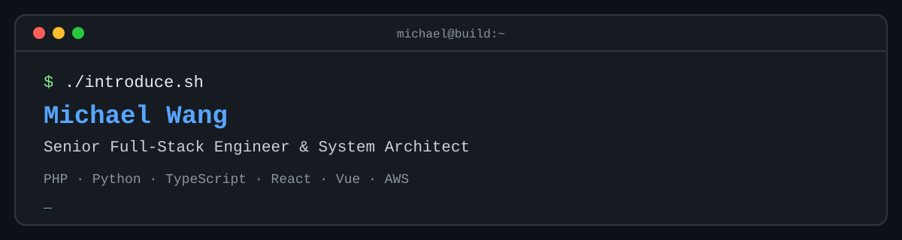

<p align="center">
  
</p>

<p align="center">
  <a href="https://isocked.com"></a>
  <a href="https://www.linkedin.com/in/michael-wang-22b23b66"></a>
  <a href="https://twitter.com/tookit"></a>
</p>

```bash
$ whoami
Michael Wang — Senior Full-Stack Engineer & System Architect

$ location
Shenzhen, China

$ mission
Build dependable SaaS and B2B products, from product UX to cloud infrastructure.
```

## `~/stack`

<p>
  
  
  
  
  
  
  
  
  
</p>

| Domain | Focus |
| :-- | :-- |
| `architecture/` | SaaS platforms, B2B workflows, service boundaries |
| `backend/` | APIs, integrations, data models, performance |
| `frontend/` | Maintainable interfaces with React, Vue, and Next.js |
| `delivery/` | Cloud infrastructure, pragmatic automation, developer experience |

## `~/now`

- Exploring practical AI-assisted engineering workflows.
- Building high-signal developer tools and product experiences.
- Writing about systems, craft, and the path from idea to shipped software at [isocked.com](https://isocked.com).

## `~/open-source`

<table>
  <tr>
    <td width="50%">
      <a href="https://github.com/tookit/vue-material-admin"><strong>vue-material-admin</strong></a><br />
      A Vue Material Design admin template.<br /><br />
      <code>Vue</code> <code>Material Design</code>
    </td>
    <td width="50%">
      <a href="https://github.com/tookit/vuetify-cascader"><strong>vuetify-cascader</strong></a><br />
      A cascader select component for Vuetify.<br /><br />
      <code>Vue</code> <code>Vuetify</code>
    </td>
  </tr>
</table>

## `~/connect`

```text
website  → https://isocked.com
linkedin → linkedin.com/in/michael-wang-22b23b66
x        → x.com/tookit
```

<p align="center"><sub>Keep foolish. Keep building.</sub></p>
